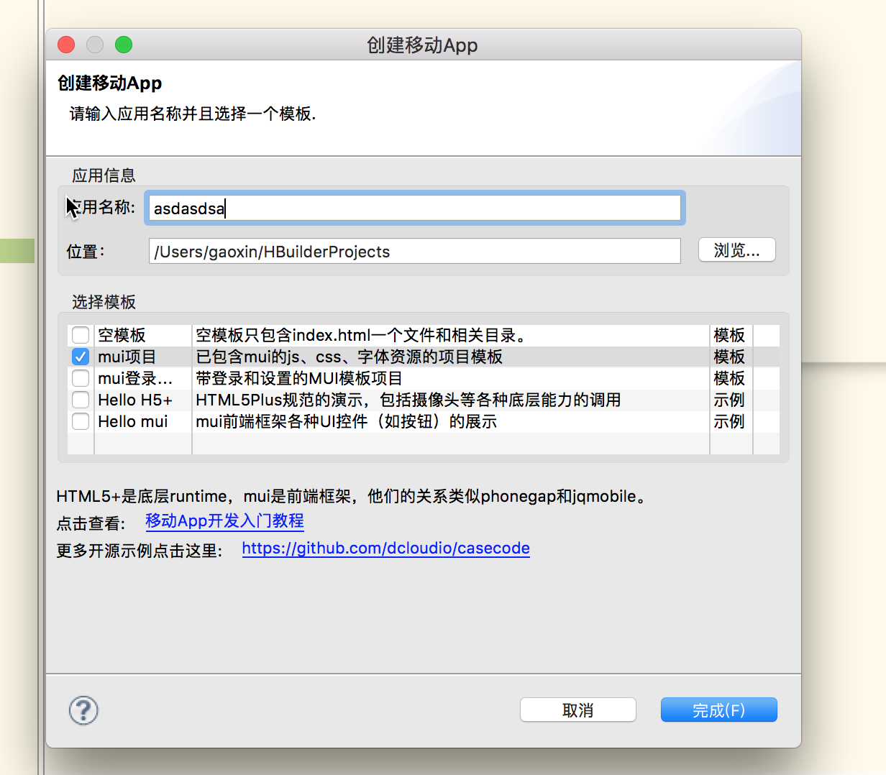
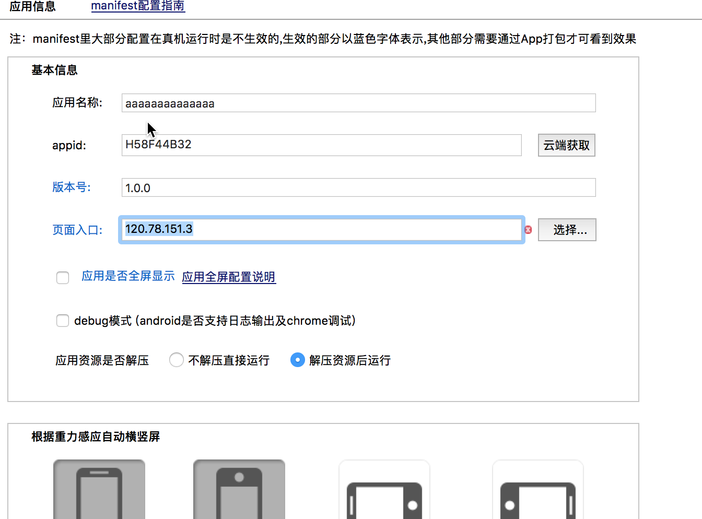
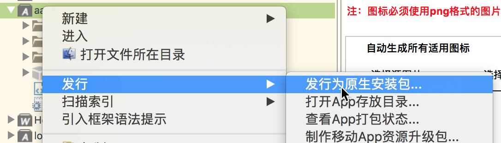
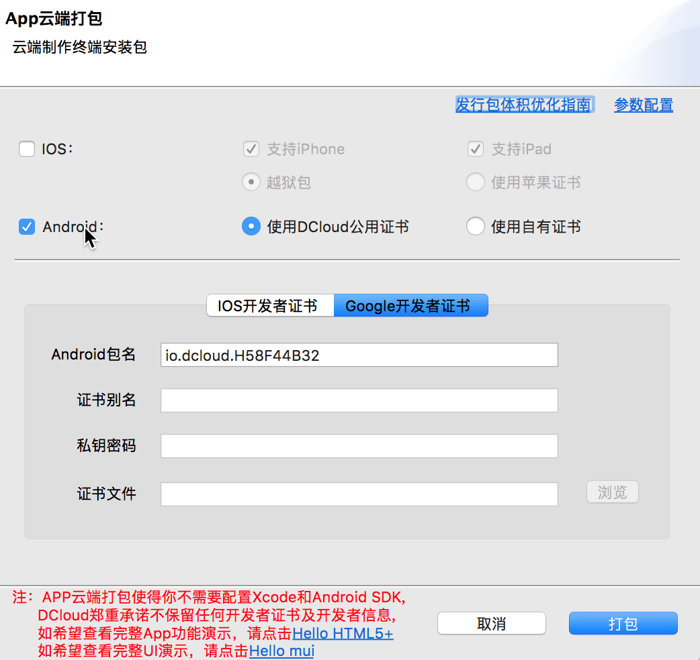

# app 打包步骤
# android  1. java  eclipes
1. 在hbuilder里面创建mui项目
    
2. 在manifest.json修改页面入口地址，以及图标
    
3. 发行为原生的安装包
    

4. 打包过程
    

5. 打包完成

6. 安装文件迁移到你的服务器，提供下载
    ```
    def download(req):
        f=open("upload/test.apk","rb")
        res=HttpResponse(f)
        res["content-type"]="application/octet-stream"
        res["content-disposition"]="attachment;filename='1.apk'"
        return res
    ```


