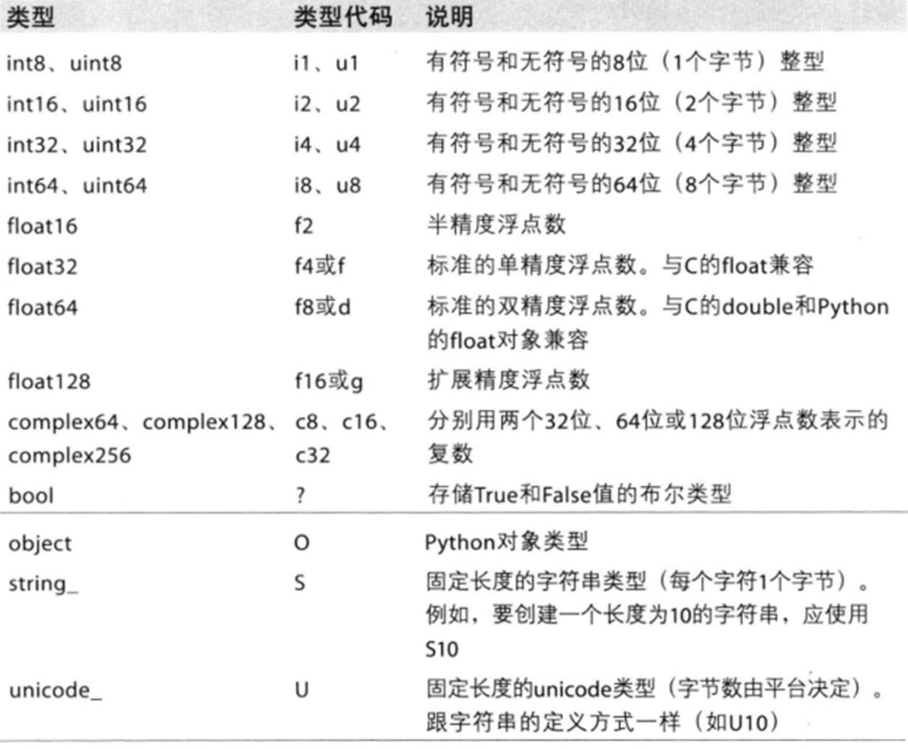

### 数组操作
1. 数组元素的访问
    - 通过下标访问
        ```
        b = np.array(([1,2,3],[4,5,6],[7,8,9]))
        b[0]                                #第0行
        >>>array([1, 2, 3])
        b[0][0]                             #第0行第0列的元素值
        >>>1
        ```
    - 同时访问多个元素
        ```
        x = np.arange(0,100,10,dtype=np.floating)
        x[[1, 3, 5]]          # 同时访问多个位置上的元素
        >>>array([ 10.,  30.,  50.])

        ```
    - 切片访问
        ```
        a=np.array([1,2,3,4,5,6])
        print(a[1:4])
        ```
    - 花式索引
        ```
        a=np.array([[1,2,3],[4,5,6]])
        print(a[1,0:2])
        ```
2. 数组特性
    - 数组的维数
        ```
        nparr.ndim
        ```
    - 数组的维度
        ```
        nparr.shape
        ```
    - 数组的总个数
        ```
        nparr.size
        ```
    - 数组元素的类型
        ```
        nparr.dtype
        ```
        
3. 数组操作
    - 数组转转
        ```
        nparr.tolist() # 数组转换列表
        nparr.tostring() # 数组转换字节
        ```
    - 数组追加值
        ```
        np.append(arr,val)
        ```
    - 数组插入值
        ```
        np.insert(arr,index,val)
        ```
    - 元素重复
        ```
        arr.repeat(nums)
        ```
    - 修改指定位置的值
        ```
        arr.put(index,val)
        ```
    - 数组排序
        ```
        x = np.random.randint(1, 100, 10)   # 随机整数
        x
        array([84, 34, 22, 67,  5,  6, 76, 36, 99, 30])
        np.argsort(x)                       # 排序后的原下标
        array([4, 5, 2, 9, 1, 7, 3, 6, 0, 8], dtype=int64)
        x[np.argsort(x)]                    # 按序访问元素
        array([ 5,  6, 22, 30, 34, 36, 67, 76, 84, 99])
        x[sorted(np.argsort(x)[-5:])]    # 按原来的顺序返回最大的5个数
        array([84, 67, 76, 36, 99])

        ```
    - 求幂
        ```
        np.power(10,2)
        ```
    - 数组元素求和
        ```
        np.sum(nparr)
        ```
    - 求根
        ```
        np.sqrt(nparr)
        ```